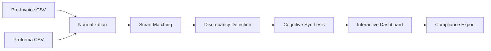

# Vigilo Mini — Intelligent Freight Audit & Dispute Pipeline

Vigilo Mini is a professional AI-native prototype designed to automate the **Step 1 to 4** workflow of freight audit reconciliation. Developed as a technical demonstration for **Axonovia**, this tool bridges the gap between deterministic data matching and cognitive AI synthesis to identify billing discrepancies in seconds.


---

## Technical Value Proposition

Vigilo Mini transforms complex, unstructured transport data into actionable business intelligence through a high-performance auditing pipeline.

| Category | Implementation | Business Value |
|----------|----------------|----------------|
| **Data Ingestion** | One-Click Demo / CSV Multi-Import | Zero-configuration onboarding for immediate audit results. |
| **Logic Engine** | Strict TypeScript Pipeline (Normalization -> Matching -> Detection) | 100% mathematical accuracy on line-by-line reconciliation. |
| **Cognitive Layer** | LLM-Native Analysis (Nvidia Nemotron / Qwen 2.5) | Automated synthesis of disputes with human-readable reasoning. |
| **Resilience** | Deterministic Fallback Mechanism | Guaranteed continuity of service even during AI provider outages. |

---

## System Architecture

The project is built on a modular "Auditor Pipeline" architecture, ensuring data integrity at every transition.



Detailed technical breakdown available in: **[SUMMARY.md](SUMMARY.md)**.

---

## Core Features

### 1. Unified Audit Dashboard
Real-time tracking of audit KPIs including total lines analyzed, detected discrepancies, and estimated recoverable amounts.


### 2. High-Fidelity Dispute Generation
Every detected discrepancy is accompanied by a professional "Litige" card, detailing the error type (Overbilling, Missing Reference, etc.) and a recommendation for resolution.

### 3. Professional Compliance Export
Generator of PDF audit reports that include executive summaries and detailed dispute tables, ready for stakeholder review.

---

## Getting Started

### Prerequisites

- Node.js 18+
- [OpenRouter](https://openrouter.ai/) API Key (Optional, for High-Fidelity AI mode)

### Installation

1. **Clone and install dependencies:**
   ```bash
   git clone [repository-url]
   cd vigilo-mini
   npm install
   ```

2. **Configuration:**
   Create a `.env.local` file in the root:
   ```env
   NEXT_PUBLIC_AI_MODE_ENABLED=true
   NEXT_PUBLIC_OPENROUTER_API_KEY=your_api_key_here
   NEXT_PUBLIC_OPENROUTER_MODEL=nvidia/llama-3.1-nemotron-70b-instruct
   ```

3. **Run Dev Server:**
   ```bash
   npm run dev
   ```
   Open [http://localhost:3000](http://localhost:3000) to view the application.

---

## Deployment

The application is optimized for Vercel and can be deployed with a single command:
```bash
vercel
```

---

## Contact & Candidacy

**Candidate**: Belalia Mohamed Oussama  
**Role**: AI / Full-Stack Engineer  
**Project**: Vigilo Mini PoC for Axonovia (48h Design Sprint)

*Built with precision to define the future of freight audit.*
