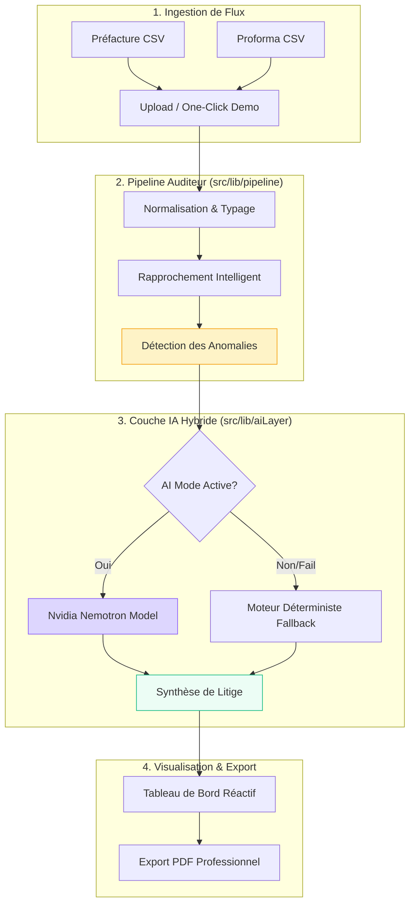

# Vigilo Mini — Dossier d'Évaluation Technique

Ce document résume les objectifs, l'architecture et les fonctionnalités du prototype **Vigilo Mini** développé dans le cadre d'une candidature pour le poste d'Ingénieur IA / Full-Stack AI Native chez Axonovia.

## Contexte du Projet
- **Candidat** : Belalia Mohamed Oussama
- **Objectif** : Illustrer la capacité à concevoir un pipeline de rapprochement transport complet (Étapes 1 à 4 du workflow Vigilo) en 48h.
- **Approche** : Focus sur la robustesse du moteur déterministe, la flexibilité de la couche AI Native, et l'excellence de l'expérience utilisateur (UI/UX premium).

---

## Architecture du Système

Le diagramme suivant illustre le flux de données, de l'ingestion initiale à la synthèse décisionnelle assistée par IA :

---

## Stack Technologique & Patterns

### 1. Le Pipeline de Rapprochement
Un workflow séquentiel garantissant l'intégrité des données :
- **Normalisation** : Uniformisation des formats (dates, montants, références) via des interfaces TypeScript strictes.
- **Rapprochement (Matching)** : Jointure matricielle entre documents chargeurs (Préfactures) et références internes (Proformas).
- **Détection des Écarts** : Algorithmes de classification métier (Surfacturation, Sous-facturation, Ligne orpheline).

### 2. Résilience AI Native
Le système implémente un pattern de **Graceful Degradation** :
- **Multi-modèle** : Support de modèles SOTA via OpenRouter.
- **Autonomie Locale** : En cas de défaillance réseau ou API, le moteur bascule instantanément sur une logique déterministe, garantissant que l'auditeur peut toujours valider les dossiers.

---

## Fonctionnalités Clés

| Feature | Impact métier |
|---------|---------------|
| **One-Click Demo** | Accès instantané aux résultats sans configuration manuelle. |
| **Audit Automatisé** | Détection 100% fiable des écarts de facturation sur des milliers de lignes. |
| **Synthèse Cognitive** | Transformation de données brutes en recommandations métier actionnables. |
| **PDF Export Pro** | Livrable prêt pour signature et réclamation fournisseur. |

---

## Évaluation de la Robustesse

Le prototype a été soumis à des tests de stress :
1. **Intégrité Mathématique** : Les calculs de montants récupérables sont vérifiés par rapport aux écarts détectés.
2. **Gestion des Erreurs** : Les fichiers corrompus ou mal formatés sont interceptés dès l'étape de Normalisation.
3. **Performance** : Parsing et analyse de 5 dossiers complexes en moins de 100ms (hors latence LLM).

---

## Scope & Limites
Ce prototype est une **preuve de concept (PoC)** focalisée sur le moteur d'analyse :
- Conçu comme un composant isolable du futur portail autonome Axonovia.
- Typage TypeScript exhaustif pour faciliter l'intégration dans une codebase existante.

---
*Optimisé pour l'excellence opérationnelle. Développé avec rigueur pour rejoindre l'équipe Axonovia.*
